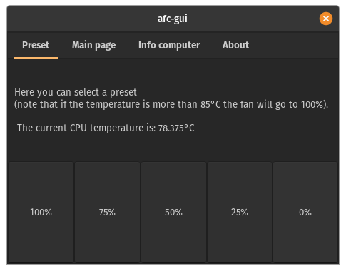
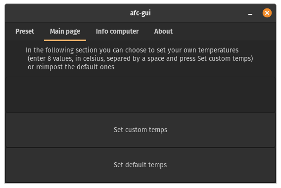
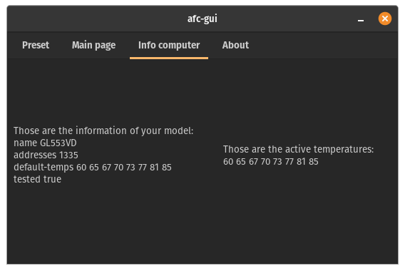
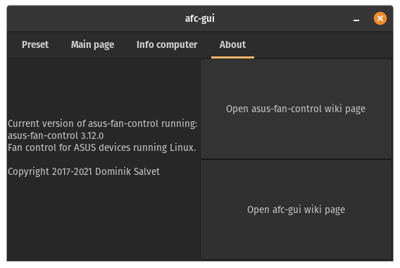

# afc-gui
GUI for the asus-fan-control project

# Dependency:
* asus-fan-control installed
* python3


# Installation:

 * Using [GitPack](https://github.com/dominiksalvet/gitpack): `sudo gitpack install https://github.com/Greifent/afc-gui-gtk3.git`, then just type in the terminal `afc-gui-gtk3` or look for afc-gui-gtk3 in your launcher.

 * Using git clone: `git clone https://github.com/Greifent/afc-gui-gtk3.git`, navigate afc-gui/prgm/, move afc-gui to `/usr/bin/` the MAINGUI.glade to `/usr/share/afc-gui-gtk3` (you will have to create the afc-gui-gtk3 folder) and afc-gui.desktop to `/usr/share/applications/`, execute the `afc-gui-gtk3` or look for afc-gui-gtk3 in the launcher of your distribution
 
 * Manual installation:
 
To install just run these commands
```
git clone https://github.com/Greifent/afc-gui-gtk3.git
cd afc-gui-gtk3/src/
sudo cp afc-gui /usr/bin/
sudo mkdir /usr/share/afc-gui-gtk3
sudo cp MAINGUI.glade /usr/share/afc-gui-gtk3/
sudo cp afc-gui-gtk3.desktop /usr/share/applications/
```
To uninstall these:
```
sudo rm /usr/bin/afc-gui-gtk3
sudo rm -r /usr/share/afc-gui-gtk3/
sudo rm /usr/share/applications/afc-gui-gtk3.desktop
```
To update the version run the uninstall commands, then the install ones.

# Photo:

This is the preset page



This is the main page



This is the info page



This is the about page


